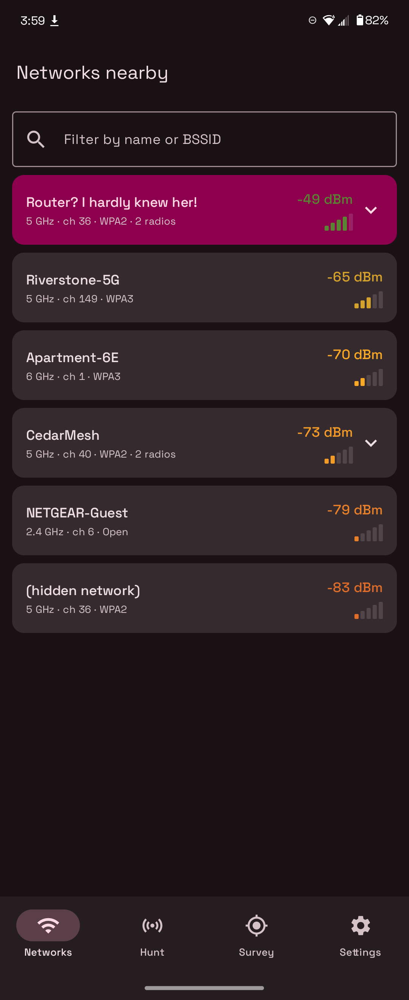
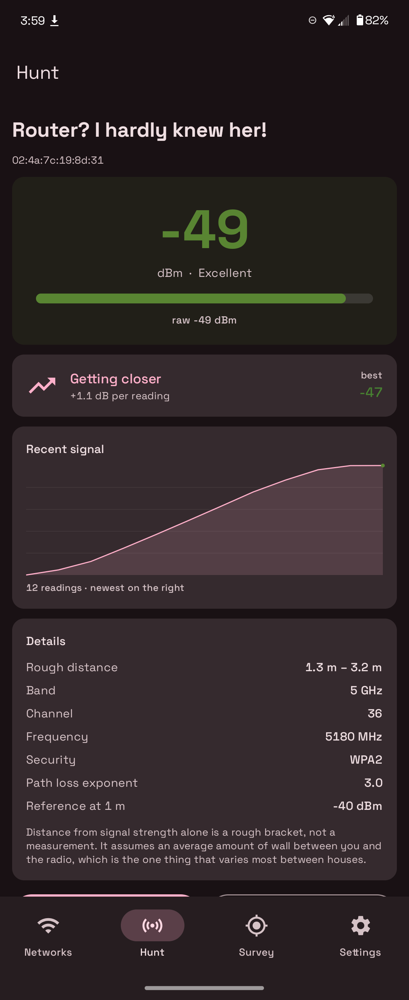
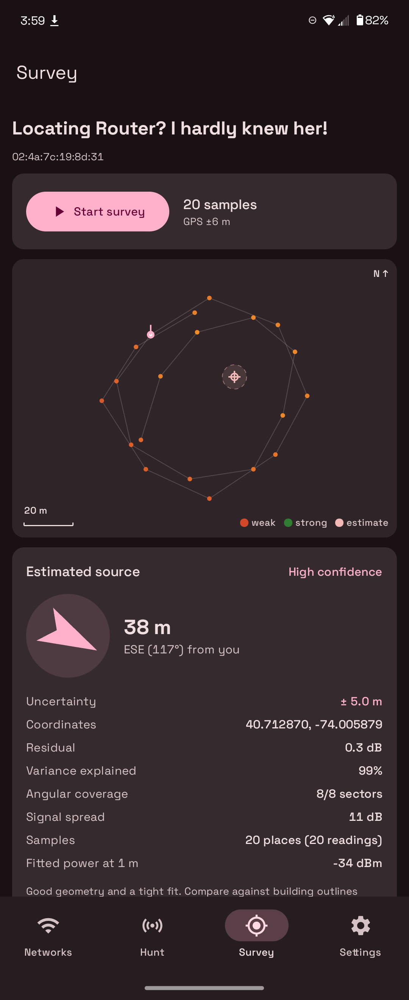
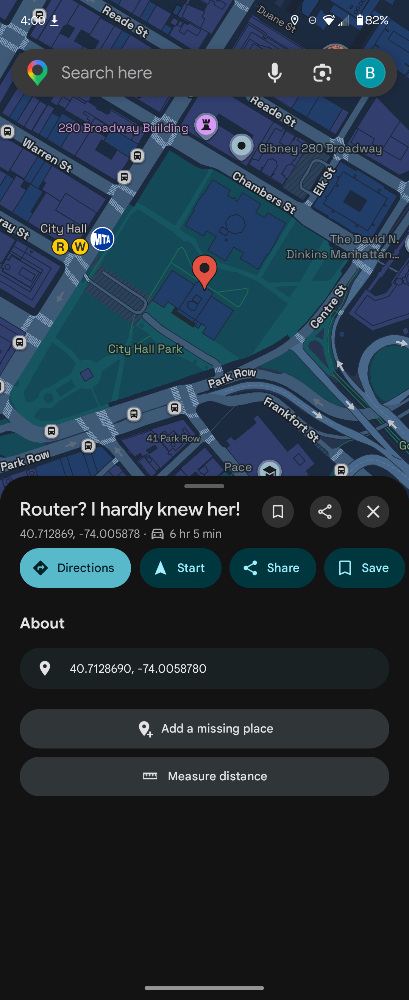

# Corny GW

An Android app that works out **where a Wi-Fi network is physically coming from**, using
nothing but the signal strength your phone already sees.

You know the one. It has been sitting in your network list for months with a name that is
just a bit too pleased with itself, and you have no idea which of your neighbors is
responsible. This app narrows it down to a position on a map, with an honest error bar.

---

## Screenshots



**Networks** — everything in range, grouped by name and sorted strongest first, with a filter
box for name or BSSID. Each row carries the band, channel, security and signal in dBm,
colored by quality. Names broadcast by more than one radio are marked *2 radios* and expand
so you can pick a single BSSID rather than an average of the whole mesh kit. The selected
target stays highlighted at the top; hidden networks appear as `(hidden network)` and are
still perfectly locatable, since the beacon is what matters, not the name.



**Hunt** — live signal for the chosen radio. The gauge shows the smoothed value with a
quality word, and the raw reading underneath so you can see how much the smoothing is doing.
The trend card turns the last several readings into warmer/colder guidance (*Getting closer,
+1.1 dB per reading*) and remembers the best value seen, which is what you actually navigate
by. Below that, a sparkline of recent history and a details panel: rough distance as a
bracket rather than a number, band, channel, frequency, security, and the path loss
parameters currently in use.



**Survey** — record while you walk. Each fresh scan is paired with a GPS fix, and the map
draws the track in a metric plan view: sample points colored by signal strength, the fitted
source as a crosshair, and a scale bar. Underneath, the estimate itself — distance and
bearing from where you are standing, an arrow that points at it, and the numbers that say
whether to believe any of it: uncertainty, residual, variance explained, angular coverage,
signal spread, sample count and fitted power at 1 m. The confidence label is derived from
those, not from the residual alone. This walk closes a loop around the target, which is why
it reads 8/8 sectors and high confidence.



**Open in Maps** — the estimate handed to whatever maps app you have, labeled with the
network name, so you can compare it against building outlines and rooftops. The uncertainty
disc does not travel with the pin, so keep the figure from the Survey screen in mind: a
confident fit is still a circle several meters wide, not a doorstep.

---

## How it works

Every access point continuously broadcasts beacon frames that any device can hear without
connecting to anything. Your phone reports the strength of those beacons as RSSI, in dBm.
Signal strength falls off predictably with distance, so a reading is a (very noisy) estimate
of how far away the transmitter is.

One reading gives you a radius. Readings from several places, and the distance rings
intersect at a point.

The app models this with standard log-distance path loss:

```
rssi(d) = ref − 10 · n · log₁₀(d)
```

where `ref` is the transmitter's apparent power at one meter and `n` is the path loss
exponent (≈2 in open air, ≈3 on a typical street, 4+ through heavy construction).

### Solving without knowing the transmit power

`ref` is unknown — you cannot walk up to a neighbor's router to calibrate it. But it enters
the equation linearly, so rearranging:

```
vᵢ = rssiᵢ + 10 · n · log₁₀(dᵢ) = ref
```

For the *correct* transmitter position, every `vᵢ` is the same number. So the cost function
is simply **the variance of `v`**, and the best `ref` for any candidate position is the mean
of `v`. A three-parameter fit collapses into a two-dimensional search with a closed form for
the third — no matrix algebra, and nothing to diverge.

The search itself is a coarse grid sweep (4 m) followed by two refinements (1 m, then
0.25 m). Gradient descent would be faster and worse: the cost surface is genuinely
multi-modal when your walk is one-sided, and a local optimizer silently returns whichever
basin it started in. The sweep also yields the uncertainty region for free, since the
neighborhood has already been evaluated.

---

## The three ways this goes wrong

Most of the engineering here is about *not* confidently pointing at the wrong house. Three
failure modes are real, and each is detected and reported rather than hidden.

### 1. The solver escaping to infinity

Push a candidate position far enough away and the `log₁₀(d)` term flattens out until it can
absorb almost any noise — a small residual at a completely wrong position. Every such
runaway implies an absurd transmitter, so the fit constrains the fitted power to what a real
access point can be (−65 to −15 dBm at 1 m). Because the cost of holding `ref` at a fixed
`r` is `variance + (mean − r)²`, the penalty is continuous and changes nothing wherever the
answer was already sane.

In testing this single constraint pulled a degenerate case from **219 m of error down to
1.3 m**, and a wrong-path-loss-exponent case from **305 m to 1.0 m**.

### 2. The mirror image

A straight-line walk is symmetric about its own path. A source 20 m to your left and one
20 m to your right produce *identical* readings at every point along a straight pavement.
The data cannot distinguish them, and the solver will pick one arbitrarily.

In testing it picked the side **38 m from the truth when the mirror was 6 m away**. So the
app detects a collinear route (via the eigenvalues of the sample cloud's covariance) and
plots **both** candidates, capping confidence and telling you to take a few steps
perpendicular to break the tie.

### 3. Precision mistaken for accuracy

Signal strength fixes *distance*, never *direction*. Samples taken from one spot produce a
fit that can slide anywhere along a ring and still fit perfectly — a tight residual that
means nothing. The app reports **angular coverage** (how many of eight compass sectors your
samples occupy around the fit) next to the residual, and will not claim high confidence
without it.

---

## Using it

1. **Networks** — everything in range, grouped by name, strongest first. Pick your target.
   If a name is broadcast by several radios (a mesh kit), pick a specific one: averaging them
   together points at the middle of a building rather than at hardware.
2. **Hunt** — live signal with a smoothed trace and a warmer/colder trend. Walk around and
   find roughly where it peaks.
3. **Survey** — record while you walk. Each fresh scan is paired with a GPS fix. The map
   shows your track colored by signal, the estimated source, and its uncertainty disc.
4. Open the estimate in Maps, or export the raw CSV and do your own analysis.

### Getting a good result

- **Walk around the target, not past it.** This matters more than anything else. Front,
  back, both ends of the street if you can.
- **Prefer a 5 or 6 GHz radio.** Counter-intuitively, the band that carries *worse* is the
  one you want: 2.4 GHz passes through walls so well that half the street reads within a few
  dB, while the sharper fall-off at 5/6 GHz is what distinguishes one house from the next.
  The Hunt screen says so when you have picked a 2.4 GHz radio.
- **Hold the phone away from your body**, in a consistent orientation. Your own hand is
  worth about 10 dB of attenuation, which the model would otherwise read as distance.
- **Keep moving.** Readings from a spot you already sampled add confidence without adding
  information, which is the most misleading combination available.

### Wi-Fi scan throttling

Since Android 9, foreground apps get roughly **four scans per two minutes**. Past that,
`startScan()` returns cached results. The app detects this (`EXTRA_RESULTS_UPDATED`) and:

- flags stale readings in the UI instead of showing a frozen number as if it were live,
- **never records a throttled scan as a survey sample** — pairing an old reading with a new
  GPS position injects a fabricated measurement straight into the fit.

To sample properly, turn off *Developer options → Wi-Fi scan throttling* and drop the scan
interval in Settings. It makes an enormous difference to both screens.

### Calibrating the path loss exponent

You cannot stand next to a neighbor's router, but you can stand next to your own. Run a
survey on your own access point and adjust the exponent until the estimate lands where the
hardware actually is. Whatever value works for your walls will work for the street.

---

## Reading the output

| Field | Meaning | Good value |
| --- | --- | --- |
| Uncertainty | Radius within which the residual stays within 1 dB of the best | under ~15 m |
| Residual | RMS disagreement between the readings and any single source position | under ~4 dB |
| Variance explained | How much better the fit beats "signal is the same everywhere" | over ~60% |
| Angular coverage | Compass sectors your samples occupy around the fit | 4/8 or more |
| Signal spread | max − min RSSI across the walk | over ~10 dB |
| Fitted power at 1 m | Solved transmit power; a sanity check on the whole fit | −30 to −50 dBm |

A `>` on the uncertainty means the region ran off the edge of the search window — the true
figure is larger than shown.

---

## Building

Requires Android Studio (or a local Android SDK) — `compileSdk 35`, `minSdk 26`, JDK 17.

```bash
gradle wrapper          # generate the wrapper jar, not committed
./gradlew assembleDebug
./gradlew test          # unit tests for the solver
```

The Gradle wrapper JAR is intentionally not in the repository; generate it with
`gradle wrapper`, or just open the project in Android Studio.

### Tests

`app/src/test/java/.../EstimatorTest.kt` synthesises RSSI from a known transmitter position
and checks the solver recovers it — and that it *declines* to sound confident about the
configurations that are genuinely unsolvable (standing still, walking a straight line, one
sided routes, bad GPS). 22 tests covering the solver, geodesy, path loss and band mapping.

---

## Privacy and scope

The app listens for the beacon frames every access point broadcasts publicly, and records
signal strength against GPS. It **never connects to a network, never reads traffic, and
never attempts a password**. Everything stays on the device unless you export a CSV
yourself.

Locating a transmitter is an ordinary thing to want: it is how you track down interference,
find your own misplaced hardware, or settle a nagging curiosity about a name in a list.
Where it stops being fine is what you do with the answer. Take the uncertainty circle
seriously — it is usually wider than a house, and confidently accusing the wrong neighbor
is the most likely outcome of ignoring it.

## Permissions

| Permission | Why |
| --- | --- |
| `ACCESS_FINE_LOCATION` / `ACCESS_COARSE_LOCATION` | Android gates Wi-Fi scan results behind location permission, because the set of networks around you is itself a location fingerprint. Also needed for the survey's GPS. |
| `NEARBY_WIFI_DEVICES` | Scanning on API 33+. Deliberately **not** flagged `neverForLocation` — this app really does derive positions, so claiming the exemption would be untrue. |
| `ACCESS_WIFI_STATE` / `CHANGE_WIFI_STATE` | Reading scan results and requesting a sweep. `CHANGE_WIFI_STATE` does not permit joining anything. |

## Architecture

```
data/     WifiScanner (broadcast → Flow), LocationStream, HeadingStream (true-north corrected),
          Estimator (the solver), PathLoss, Geo (local ENU frame), SurveyStore (CSV)
ui/       HunterViewModel (single activity-scoped state holder), Compose screens,
          SurveyMap (metric plan view drawn on Canvas — no tiles, no API key, no network)
```

No dependency injection framework, no map SDK, no Play Services. The dependency graph is
five objects deep and the app has no network permission at all.
